# Smart Farming Tracking & Monitoring Cloud Based AI App

Its a Flutter mobile app project. Its also included python fastAPI web services and deep learning models developed by me.
There has no flutter & python code for now. But it will be add.

## Getting Started

This project is a smart farming mobile application.

Weather/Location Services,
Product Inventory System (Growing Plants Database),
Plant diseases detection for 30 different diseases with AI service,
Growing Plants are calculating with AI service and monitoring graphical charts,
Land cover tracking computer vision technique with other python services.

## Weather and Location Service

Getting Lat/Lon info, Location Service  [API Ninjas](https://api-ninjas.com/)
Weather is Flutter weather [package](https://pub.dev/packages/weather)

## Inventory System

This is a Python [FastAPI](https://fastapi.tiangolo.com/) running on my local pc.
SQLite [database](https://www.sqlite.org/index.html) has a storing plant informations.
All inventory datas observable in mobile application. Farmer it can be added growing crops or non growing plants.

## Plant Diseases Detection Service

I trained deep learning model with python.
Using dataset: Plant Village Dataset [here](https://www.kaggle.com/datasets/abdallahalidev/plantvillage-dataset), Data for: Identification of Plant Leaf Diseases Using 9-Layer Deep Convolution[Network](https://data.mendeley.com/datasets/tywbtsjrjv/1) and what I manual collection datasets.
User can be able in plant detail page upload diseases image and wait the results.

- This table showing my trained models, timing, epochs and accuracy:

| Model Name       | Trainin Time    | Total Epoch    | Accuracy  |
| :---------------:| :-------------: | :------------: | :-------: |
| AlexNet          | 163m 24s        | 100            | 0.8535    |
| DenseNet         | 9253m 17s       | 100            | 0.8765    |
| VGG16            | 367m 21s        | 100            | 0.9488    |
| ResNet18         | 139m 1s         | 100            | 0.9289    |
| EfficientNet B7  | 602m 50s        | 75             | 0.9248    |
| EfficientNet B0  | 190m 20s        | 100            | 0.8852    |

## Growing Crop Calculation

I trained MaskR-CNN deep learning model developed for object segmentation and detection by facebook [here](https://github.com/matterport/Mask_RCNN).
My deep learning model has input plant image different times. Its calculating the green area score and storing database.
All scores observable with line chart in mobile application.
User can be able in plant detail page upload growing crop image and wait the score.

- Detection plant areas:

    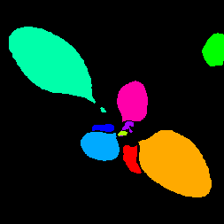

    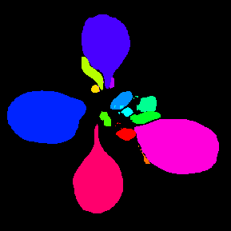

- We can see the sample line chart:

    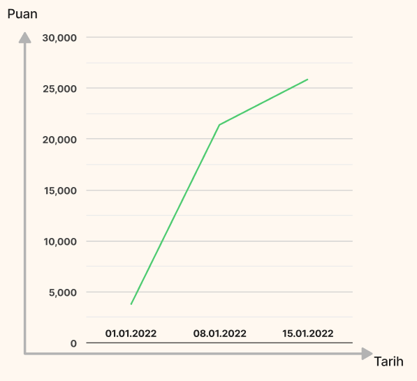

## Land Cover Changing Control and Monitoring

Its a python computer vision service. User can be able to upload his area image (satellite or air tools) and wait for the result. Its return to mobile app a processed image.

Used Technologies:

- [Python](https://www.python.org/), [FastAPI](https://fastapi.tiangolo.com/), [Keras](https://keras.io/), [PyTorch](https://pytorch.org/)
- [SQLite3](https://www.sqlite.org/index.html)
- [Flutter](https://flutter.dev/)
- [GeocodingAPI](https://docs.mapbox.com/help/glossary/geocoding-api/)
- [Ngrok](https://ngrok.com/)
- [LocalTunnel](https://localtunnel.github.io/www/)

## Splash Screen

Application will be start firstly [Flutter Native Splash](https://pub.dev/documentation/flutter_native_splash/latest/)

## Experimental

This application has different web services. This situation in flutter CRUD process with localhost its not possible so I used tunneling solutions. 

## Results

Various solutions to smart agriculture problems have been produced with deep learning and image processing methods.
With the mobile application, it was ensured that the application reached more manufacturers.
Cost-time analysis made easy for large-scale projects.
Studies at the intellectual and theoretical stage; it was pioneered to become practical, everyday practices.

## Next Steps

- Train models for better accuracy
- Language settings (EN/SP/TR/DE)
- Special code refactoring (Mixins, constants, routing etc.)
- User testing

## Screen Shots

1- Main Page:

    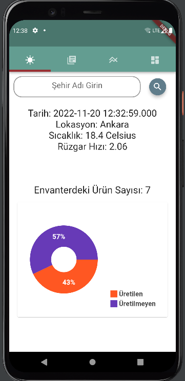

2- List Inventory:

    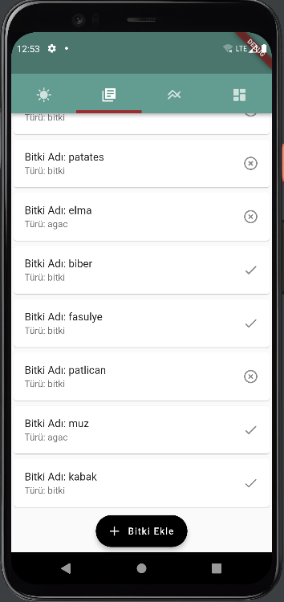

3- Add Plant in Database:

    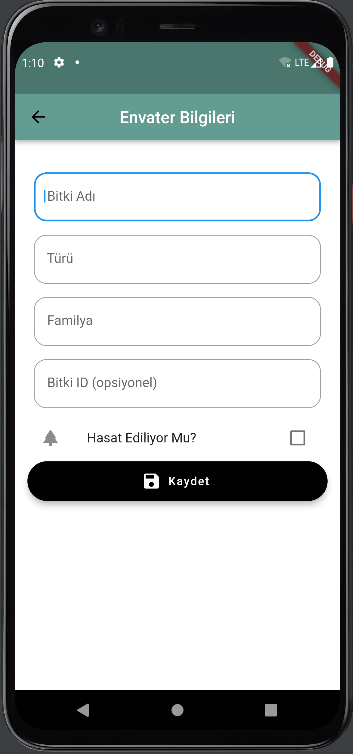

4- Plant Detail Page:

    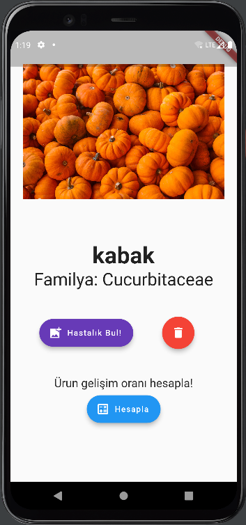

5- Detail Page Plant Diseases Prediction:

    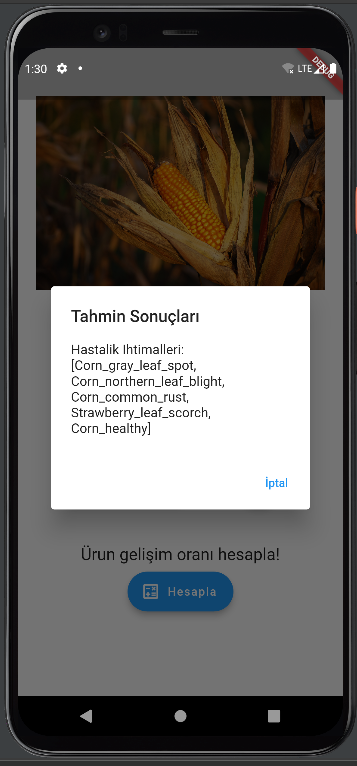

6- Detail Page Plant Growing Prediction:

    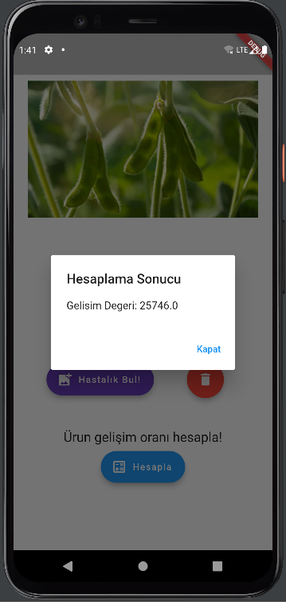

7- Growing Monitor Page Plant Growoing Line Chart:

    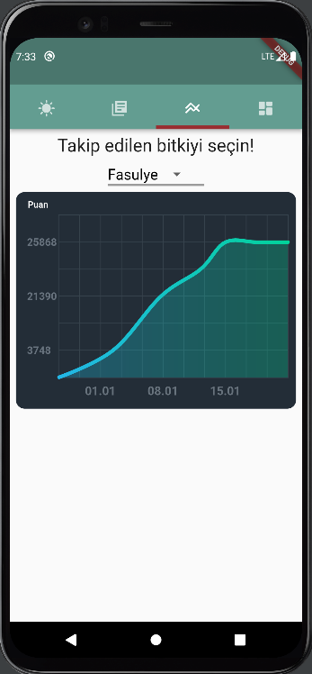

8- Land Cover Changer Page Image ColorMap:

  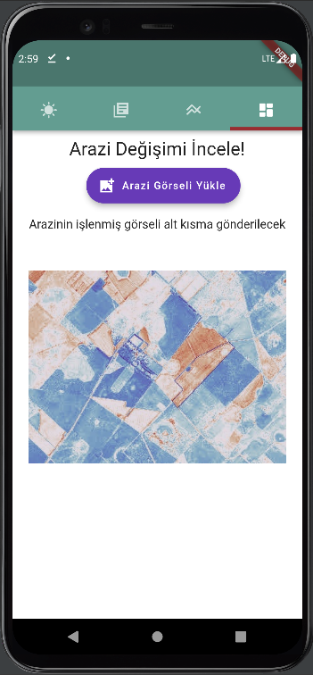

